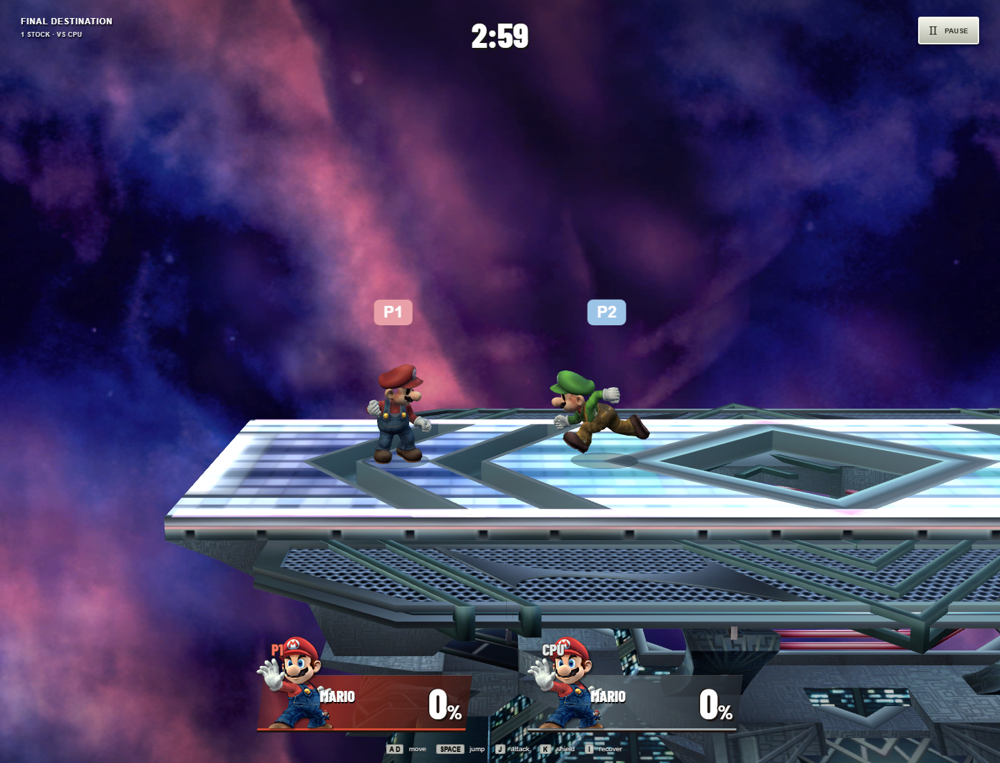

# Brawl Browser Lab

[](https://github.com/luckeyfaraday/smash-bros-brawl/actions/workflows/ci.yml)

An experimental browser-native reconstruction of **Super Smash Bros. Brawl**
gameplay, built with TypeScript, Three.js and data from the USA Rev 1 release.
Play Mario, Link, Kirby or Pikachu on Final Destination in local two-player or
CPU matches, or inspect combat frame by frame in the training room.

This is an independent fan and research project, unaffiliated with Nintendo.
Physics, CPU decisions and several common rules are reconstructed; equivalence
to the original game has not been established.



**Game assets are required to play.** A disc image and the exported models,
textures and animations are not included. Prepare them from your own local
game files. Extracted AI/stage data, gameplay captures and third-party reference
material are tracked; see [third-party notices](THIRD_PARTY_NOTICES.md).

## Features and scope

- Four fighters with movement, ground and aerial attacks, specials, grabs,
  throws, shields, dodges, ledges, knockdowns and floor techs.
- Local and CPU matches with stock/time rules, pause and rematch.
- Keyboard/gamepad input and touch controls for a subset of moves.
- Training with frame stepping, collision views and deterministic recording/replay.
- Static builds with animation files split for Cloudflare Pages.

The scope is one stage and four fighters. Online play, story mode, a full item
roster, additional stages and complete audio/effects are not implemented.

## Get started

Use **Node.js 24** and npm. A fresh clone can run source checks without game assets:

```sh
git clone https://github.com/luckeyfaraday/smash-bros-brawl.git
cd smash-bros-brawl
npm ci
npm run check
```

To play, follow [asset preparation](docs/getting-started.md#prepare-game-assets)
on Windows, then run `npm run dev` and open the URL Vite prints. Choose fighters
and match rules, then select **Ready to Fight**.

Open `/lab.html` for training tools and `/visual-progress.html` for historical
gameplay captures. Prepared assets run on Windows, macOS and Linux.

## Basic controls

| Action | Player 1 | Player 2 |
| --- | --- | --- |
| Move / crouch | A, D / S | Arrow keys |
| Jump | Space | Enter |
| Attack | J | / |
| Shield / dodge | K | , |
| Smash attack | L | . |
| Neutral / up special | U / I | ' / ; |
| Side / down special | O / G | [ / Backslash |
| Grab | F | ] |
| Run modifier | Left Shift | Right Shift |
| Pause | Escape or P | Escape or P |

Use **How to play** in the title or pause menu for complete controls and gamepad
bindings.

## Build and test

| Command | Purpose | Local assets needed? |
| --- | --- | --- |
| `npm run check` | Type checking, asset-independent tests and client compilation | No |
| `npm test` | Complete unit and simulation tests | Yes |
| `npm run test:browser` | Browser gameplay and interface tests | Yes |
| `npm run build` | Playable static build in `dist`, with split animations | Yes |
| `npm run preview` | Serve the production build | Build required |

GitHub CI runs `npm run check` on Linux and Windows. It does **not** establish
gameplay correctness; simulation, browser and original-disc checks require
local assets. See [validation](docs/getting-started.md#validation).

## Documentation

- [Getting started and troubleshooting](docs/getting-started.md)
- [Deploying to Cloudflare Pages](docs/deployment.md)
- [Roadmap and current limits](docs/roadmap.md)
- [Implementation notes and detailed controls](docs/implementation-notes.md)
- [Game interface validation](docs/brawl-ui-validation.md)
- [CPU AI provenance and limitations](docs/cpu-ai-validation.md)

## Contributing and support

Read [CONTRIBUTING.md](CONTRIBUTING.md) before opening a pull request. Use the
[issue templates](https://github.com/luckeyfaraday/smash-bros-brawl/issues/new/choose)
for bugs and proposals, and follow the [code of conduct](CODE_OF_CONDUCT.md).
Report vulnerabilities through the process in [SECURITY.md](SECURITY.md).

## Licensing and credits

A license has not yet been selected for the original project code. Third-party
software, game material and fonts retain their own terms; see
[THIRD_PARTY_NOTICES.md](THIRD_PARTY_NOTICES.md) for scope and attribution.
